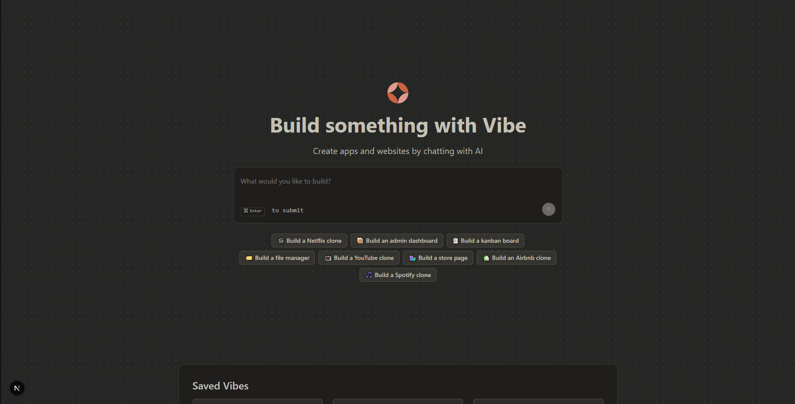

# Vibe

Vibe is an AI-powered app builder that goes beyond generating code — it lets you **inspect, explore, and interact with the entire system**.

Instead of treating AI output as plain text, Vibe structures it into a **message-driven workflow**, executes it in a sandbox, and provides both **live preview and full code visibility**.

---

## 🖥️ Preview

### Home Page

<p align="center">
  
</p>

### Chat + Code Explorer

<p align="center">
  
</p>

---

## 🚀 What makes it different

Most AI tools stop at generating code.

Vibe focuses on:

- **Structured outputs (Message + Fragment model)**
- **Async agent workflows**
- **Full code inspection + preview**
- **Project-scoped conversations**

---

## 🧠 Core Concepts

### Message-driven system

- Each interaction is stored as a `Message`
- AI responses are broken into `Fragments`
- Enables structured rendering and extensibility

### Fragment-based architecture

- Responses are not just strings
- Includes `<task_summary>` + previewable outputs

### Project-scoped workflows

- Each project has isolated chat + state
- No global mixing of conversations

### Async execution

- Uses Inngest for background workflows
- Decouples request → response lifecycle

---

## ✨ Features

### 🤖 AI App Generation

- Generate apps via prompts
- Structured AI responses

### 🖥️ Live Preview

- Runs code in E2B sandbox
- Preview via iframe
- Open / refresh / copy sandbox URLs

### 📁 Code Explorer

- File tree (DFS-based transformation)
- Breadcrumb navigation
- Syntax highlighting (Prism.js)
- Copy support

### 🔀 Dual View

- Switch between:
  - Live preview
  - Code view

### 💬 Messaging System

- Project-based chat
- Structured responses (`<task_summary> + fragments`)
- Loading states + auto-refresh

### 🎨 UI/UX

- Theme switching (light/dark/system)
- Responsive layout
- Auto-resizing input

### 🏠 Home Experience

- Guided project creation (templates + prompts)
- Saved projects dashboard

---

## 🏗️ Architecture

### Frontend

- Next.js (App Router)
- React + TypeScript
- Tailwind CSS + shadcn/ui

### Backend

- tRPC + React Query

### Database

- Prisma + PostgreSQL (Neon)
- TIMESTAMPTZ for correct time handling

### Background Jobs

- Inngest (event-driven workflows)

### AI + Execution

- OpenAI + E2B sandbox

---

## 🔄 How it works

1. User submits a prompt
2. Message is stored
3. Inngest triggers agent
4. AI generates structured response
5. Fragments are saved
6. Code runs in sandbox
7. UI updates with preview + code

---

## 🧩 Folder Structure

modules/
messages/
projects/
home/
ui/

Feature-based organization for scalability.

---

## 📌 Key Learnings

- DFS is directly useful for UI (file trees)
- AI systems need structured persistence
- Async workflows scale better than sync APIs
- UI should reflect system state, not just data

---

## 🛠️ Getting Started

### Install

```bash
npm install
# or
bun install
```

**ENV**
OPENAI_API_KEY=your_key
E2B_API_KEY=your_key
DATABASE_URL=your_db

**RUN**
npm run dev
